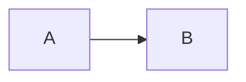

# PREREQUISITI 

Il programma genera un numero casuale tra 1 e 100. 
Il programma chiede all'utente di inserire un numero 
Se l'utente non indovina, il programma dà degli aiuti (pari/dispari, più alto/più basso) - moduli
L'utente ha un numero di tentativi pari a 5
Il programma stampa un messaggio di feedback (complimenti, hai esaurito i tentativi disponibili)

