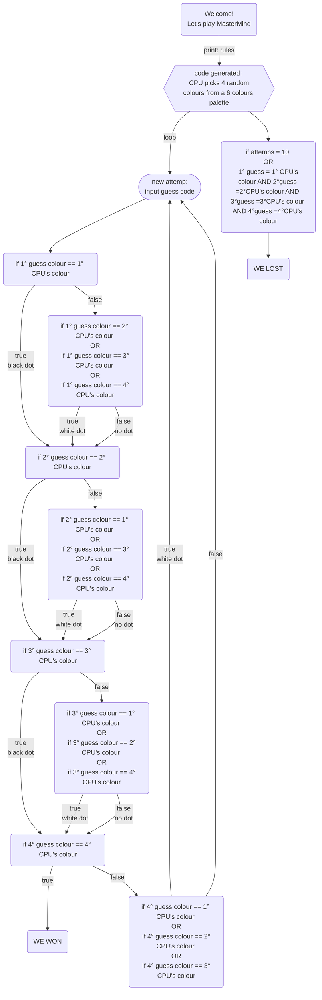

Un'applicazione per giocare a Mastermind contro il computer.

## Obiettivo applicazione: regole del gioco

Mastermind è un gioco da tabolo astratto di critto analisi per due giocatori, in cui un giocatore, in questo caso il computer, genera un codice segreto composto da un numero variabile di cursori, mentre tu sarai il decodificatore e dovrai indovinare tale codice. 

Ad ogni turno potrai scegliere da una palette colori i pioli che secondo te compongono il codice, sono ammesse ripetizioni.
In risposta, avrai due tipi di suggerimento:
- se hai indovinato un colore e la sua posizione, ti verrà suggerito un piolo nero;
- se hai indovinato un colore ma non la sua posizione, ti verrà invece suggerito un piolo bianco. 

Se indovini il codice entro il numero di tentativi predeterminato hai vinto la partita. 

### Versione 1.0: capire la logica inserendo i confronti manualmente
-  [x] Generare una lista di colori tra cui il Codificatore potrà scegliere
-  [x] Generare singolarmente i colori estratti dalla CPU
-  [x] Creare singolarmente menu multiselezione per scelta colori
-  [x] Ciclo while [break: numero tentativi: 10; codiceCpu = codiceSegreto]: comparazione tra codice manuale (16 if)

### Versione 2.0: una volta capita la logica dietro ai confronti manuali, sintetizzarli tramite cicli for
-  [ ] Chiedere all'utente il suo nome: rendere persistente questa info con anche il suo punteggio alla fine del gioco
-  [x] Generare una lista di colori tra cui il Codificatore potrà scegliere
-  [x] Generare  i colori estratti dalla CPU e inserirli in un array
-  [x] Creare  menu multiselezione per scelta colori e inserimento in un array
-  [x] Ciclo while [break: numero tentativi: 10; codiceCpu = codiceSegreto]: comparazione con for
-  [x] Possibilità di tenere i risultati tracciati tramite tabella
-  [ ] Implementare menu inizio gioco

### Refactoring codice
-  [ ] Creazione nuovo repository: first complete project

## Wishlist
-  [x] Readme con regole del gioco
-  [x] Mermaid
-  [ ] Implementare funzioni
-  [ ] Rendere l'interfaccia appetibile con tabella (servono funzioni T.T)
-  [x] Livelli di difficoltà: chiede in quanti turni e con quante pedine giocare (inventare sistema più efficiente per punteggi)
-  [x] Chiedere all'utente il suo nome: rendere persistente questa info con anche il suo punteggio alla fine del gioco (si può riordinare?)
-  [ ] Aggiungere data punteggi
-  [ ] Mostra i primi 5 punteggi migliori
-  [ ] Sistema di punteggi
-  [ ] Gestione eccezioni menu iniziale di scelta

## Mermaid della logica gioco
