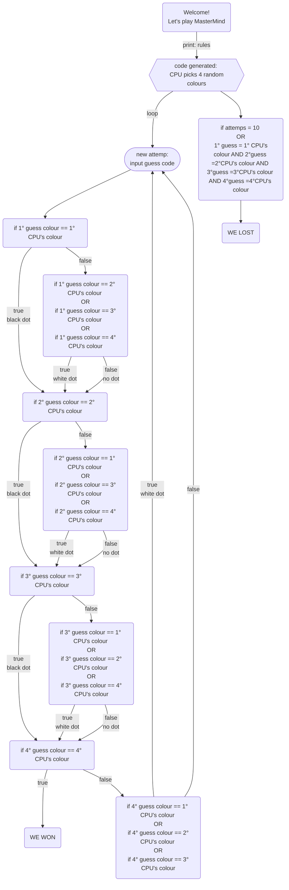

## MasterMind: progettazione

-  [] Generare una lista di colori tra cui il Codificatore potrà scegliere
-  [] Chiedere all'utente se ha intenzione di essere Codificatore o Decodificatore

## Wishlist
-  [] Mermaid
-  [] Rendere l'interfaccia appetibile con Spectre
-  [] Possibilità di salvare il nome dell'utente e il suo punteggio (inventare un sistema per punteggio (basato sul numero di turni?))
-  [] Se c'è tempo creare Versione 2.0 dove l'utente genera il codice e il computer lo indovina

### Versione 1.0: scelgo di essere il decodificatore
-  [] Chiedere all'utente il suo nome: rendere persistente questa info con anche il suo punteggio alla fine del gioco
-  [] Il codificatore genera random la combinazione di colori: ci chiede di fare la nostra prima mossa
-  [] Inserimento dei colori (forse numeri da 1 a 6): ciclo while [codificatore = tentativi]
-  [] Feedback Codificatore

