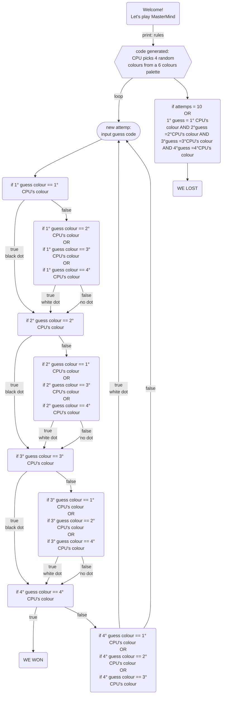

## MasterMind: progettazione

-  [x] Generare una lista di colori tra cui il Codificatore potrà scegliere
-  [ ] Chiedere all'utente se ha intenzione di essere Codificatore o Decodificatore

## Wishlist
-  [x] Mermaid
-  [ ] Rendere l'interfaccia appetibile con un panel
-  [ ] Possibilità di salvare il nome dell'utente e il suo punteggio (inventare un sistema per punteggio (basato sul numero di turni?))
-  [ ] Implementare funzioni
-  [ ] Livelli di difficoltà

### Versione 1.0: capire la logica inserendo i confronti manualmente
-  [ ] Chiedere all'utente il suo nome: rendere persistente questa info con anche il suo punteggio alla fine del gioco
-  [x] Generare una lista di colori tra cui il Codificatore potrà scegliere
-  [x] Generare singolarmente i colori estratti dalla CPU
-  [x] Creare singolarmente menu multiselezione per scelta colori
-  [x] Ciclo while [break: numero tentativi: 10; codiceCpu = codiceSegreto]: comparazione tra codice manuale (16 if)

### Versione 2.0: una volta capire la logica dietro ai confronti manuali, sintetizzarli tramite cicli for
-  [ ] Chiedere all'utente il suo nome: rendere persistente questa info con anche il suo punteggio alla fine del gioco
-  [x] Generare una lista di colori tra cui il Codificatore potrà scegliere
-  [x] Generare  i colori estratti dalla CPU e inserirli in un array
-  [x] Creare  menu multiselezione per scelta colori e inserimento in un array
-  [x] Ciclo while [break: numero tentativi: 10; codiceCpu = codiceSegreto]: comparazione con for
-  [ ] Possibilità di tenere i risultati tracciati tramite tabella

